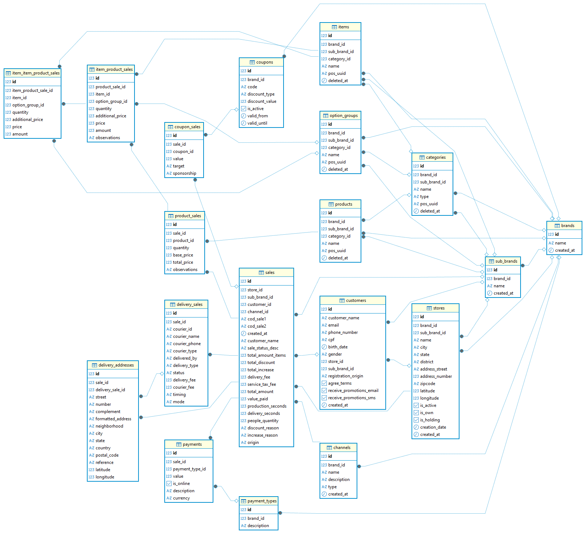

# Arquitetura do Sistema

## Resumo Geral

O sistema foi projetado para permitir que usuários não técnicos explorem dados de suas vendas/dados de forma intuitiva, fazendo consultas personalizadas sem escrever SQL.  
A aplicação segue uma arquitetura moderna, dividida em frontend (React), backend (FastAPI) e banco de dados (PostgreSQL), com cache inteligente via Redis.

## Fluxo de Dados - Query Builder Visual

1. O usuário monta filtros e colunas no frontend via interface drag-and-drop.
2. O React transforma essa seleção em um JSON estruturado.
3. O backend recebe esse JSON, valida e converte em SQL dinâmico via SQLAlchemy.
4. O resultado é retornado em formato tabular e/ou gráfico.
5. Consultas frequentemente repetidas são armazenadas em cache pelo Redis.

## Principais Tecnologias

- **Frontend:** React + Next + Shadcn/UI + Recharts + React Query Builder + dnd-kit
- **Backend:** FastAPI + SQLAlchemy + Pandas
- **Banco de Dados:** PostgreSQL
- **Cache:** Redis
- **Containerização:** Docker
- **Deploy (futuro):** Render ou Railway

## Comunicação entre Módulos

- Frontend envia JSONs representando consultas dinâmicas.
- Backend traduz o JSON para SQL seguro.
- Redis armazena resultados de consultas frequentes.
- API responde com dados processados para visualização.

## Arquitetura de Pastas

/  
├── backend/  
├── frontend/  
├── imagens/  
│ └── imagens_uteis_documentacao.png  
├── docs/  
│ ├── ARCHITECTURE.md  
│ ├── CRONOGRAMA.md  
│ └── DECISIONS.md  
└── docker-compose.yml

## Diagrama Entidade-Relacionamento

## Diagrama de Arquitetura/Fluxo Dados

## Futuras Extensões

- Sistema de salvamento de relatórios customizados.
- Geração automática de insights via IA (etapa opcional).
